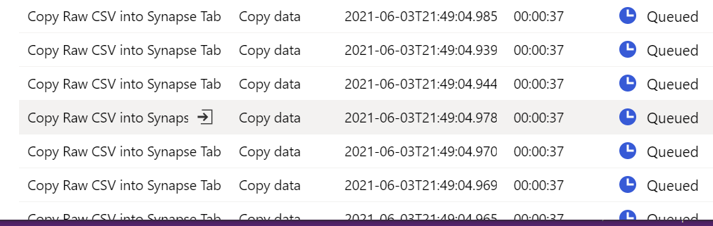
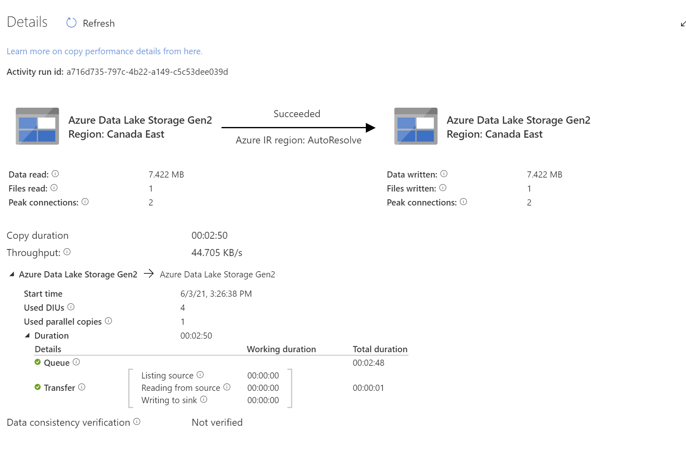

# Synapse Copy Activity Queue Time Exceedingly Long
*August 20th, 2021*

## The Problem 
In Synapse (and Azure Data Factory), each executing copy activity has a *Queue Time*, and a *Transfer Time*.  Recently I came across a customer trying to run over 70 copy activities concurrently on an Azure IR (Integration Runtime).  What the customer was complaining about was the fact that each copy activity was being queued for over 2 minutes, while the copy time took only seconds, resulting in the total pipeline length exceeding 20 minutes for seemingly simple copy activities. 

## The Pipeline

The pipeline was relatively simple.  Its job was to retrieve a list of files on ADLS gen2, filter them for CSV files, and then copy them into a SQL Pool on Azure. 

## The Symptoms
On a pipeline run, what was noticed was the copy tasks being queued, for a significant amount of time.  

When digging into the Copy Details, we saw that the transfer time for some files was only a few seconds, while the queue time was minutes!

Microsoft defines the *Queue* stage of the copy execution as 

>The elapsed time until the copy activity actually starts on the integration runtime.

So something was causing the IR to wait to run the copy activity.  But why? 

## The Solution
While struggling to figure out the solution in the Synapse workspace, I created a new Synapse workspace, copied the pipeline, and ran it.  I had Queue Times of less than 5 seconds on each copy task!!  GREAT! But what was the difference?  
Well the difference boiled down to the fact that the original synapse workspace had been **deployed with a Managed VNet**, while my new Synapse workspace did **not**. 
At the time of writing, a Synapse workspace deployed with a Managed VNet requires that compute be deployed within the VNet for each Copy Activity to execute the copy.  This takes 2-3 minutes, and can not be reused for concurrent copies, or subsequent copies.  This is why there was a 2-3 minute queue time for *each* copy activity! Ouch!!
Thankfully, their Synapse workspace wasn't shared with out groups and we were able to redeploy the Synapse workspace, without a managed VNet, and the pipeline worked as expected and completing in a reasonable time frame.  

## Summary
Managed VNets are great, but this is definitely a limitation on Synapse and hopefully will be addressed in the future.  If you have a large number of copy activities in a pipeline, expect that there will be significant queue time on each copy activity, resulting in a longer than expected execution time of the pipeline. 
