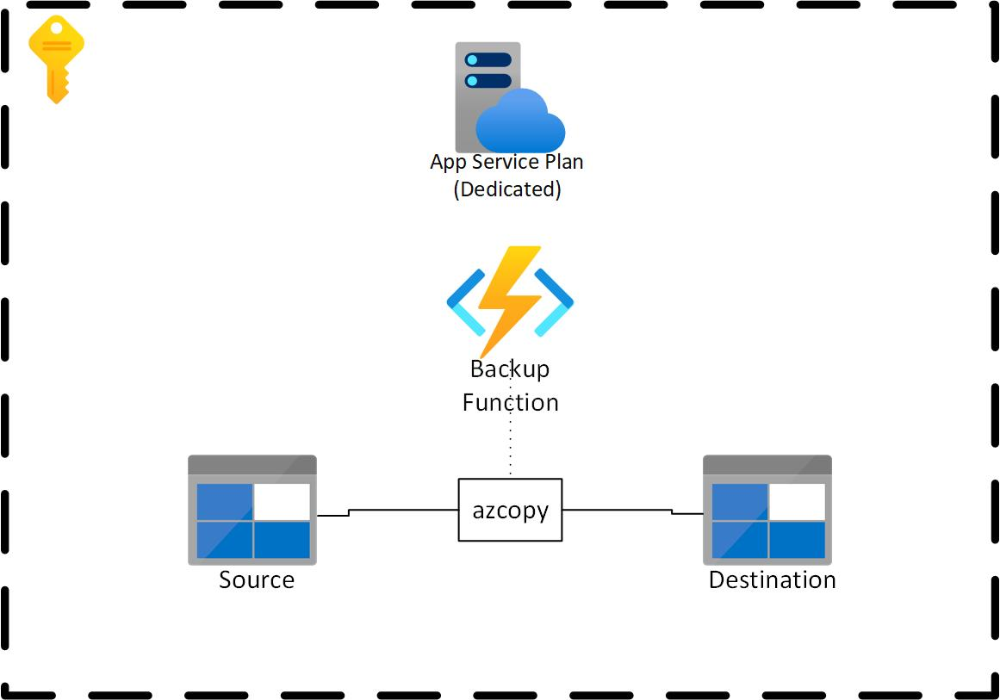

# Backing up ADLS Gen2 using AZCopy

## Introduction

Azure Data Lake Storage (ADLS Gen2) is becoming a more integral part of many organization's data strategy.  Many organizations may want to manually manage the backup and retention of this data.  While Azure [Storage Accounts keep three copies of data and has built-in redundancy](https://docs.microsoft.com/en-us/azure/storage/common/storage-redundancy) (additionally can copy the data to another data center using Geo Redundancy), companies may want to manually manage or create additional backups. With ADLS Gen2, at the time of writing, not supporting soft deletes, this could be one way organizations can recover from accidental deletion.  Additionally, organizations may want a copy of their data in a separate subscription. 

This post will go through: 
- How to use ```azcopy``` to backup your ADLS Gen2 storage account. 
- How to schedule and run the ```azcopy sync``` from within Azure using an Azure Function.

## What about Azure Backup?!

Azure Backup is the primary method of backup for VMs, Storage, and other services within Azure. But unfortunately, at the time of writing, [Azure Backup was **not** available for ADLS Gen2](https://docs.microsoft.com/en-us/azure/backup/blob-backup-support-matrix).  Hopefully in the future this will change. 


## Architecture



## Prerequisites 

This post assumes the following:
1. A source ADLS Gen2 Storage Account
2. A destination ADLS Gen2 Storage Account (the backup location)
3. AZCopy installed or downloaded

## AZCopy

From Microsoft: [AzCopy is a command-line tool that moves data into and out of Azure Storage](https://docs.microsoft.com/en-us/azure/storage/common/storage-ref-azcopy). We can use this tool to automate the backup of Azure Storage Accounts, including ADLS Gen2.  

Specifically, azcopy includes a command called [sync](https://docs.microsoft.com/en-us/azure/storage/common/storage-ref-azcopy-sync).  This replicates the source location to the destination location.  This command will be the basis of our backup strategy. 

## Authentication

[We can authenticate and authorize azcopy a number of ways](https://docs.microsoft.com/en-us/azure/storage/common/storage-use-azcopy-authorize-azure-active-directory?toc=/azure/storage/blobs/toc.json). For our purposes we can use either SAS Tokens, or Service Principals.  

Service principals are a great option if the storage account you're backing up to is within the same Azure AD Tenancy. If your source and backup storage accounts are in *different* Azure AD tenants, you must use SAS Tokens. 

### Service Principal Setup

If the source and backup storage accounts are within the *same* Azure AD tenant, a single service principal can be setup and used for authentication to each of the storage accounts. 

### SAS Token Setup

If the source and backup storage accounts are **not** within the same Azure AD tenant, you will have to setup and use SAS tokens.  You can create the SAS tokens at the storage account level, or the container level, whichever makes more sense in your situation.

> **Important:** These SAS tokens will have expiry dates, so make sure you note the expiry and update them accordingly.  

#### Source Setup

The source SAS token should have the following permissions:


#### Backup Setup
The backup storage SAS token should have the following permissions:


## Azure Function

There are a number of different ways to run ```azcopy``` in the cloud.  You could run it on a virtual machine, on a container, or others.  In my situation, [Azure Functions](https://docs.microsoft.com/en-us/azure/azure-functions/) was a valid option.  The function runs on demand, and executes the sync at a given timer interval.  It uses a c# wrapper to call the azcopy executable.  

> Fun fact, ```azcopy``` is written in go and is open source!

The function that I used is available on github, and can be found here: [https://github.com/gregorosaurus/AZCopyAzureFunction](https://github.com/gregorosaurus/AZCopyAzureFunction). 

It's a relatively simple function that just wraps the call to azcopy.  It contains one timer triggered function that contains the call to azcopy.  It uses application settings to determine the source and destination of the sync. 

In this post, we will go through how to deploy it using the ARM template and configure the function. Currently the function only supports SAS tokens, not service principals (although by the time you read this, service principals may be supported, check out the repo's README.md).

> **Important:** Azure Functions have *timeouts*.  It's important to be aware of [these timeouts](https://docs.microsoft.com/en-us/azure/azure-functions/functions-host-json#functiontimeout). If you have a azcopy sync task that takes more than 5-10 minutes, you must either use a premium or dedicated Azure Function. 

## Deployment

1. Head to the github function: [https://github.com/gregorosaurus/AZCopyAzureFunction](https://github.com/gregorosaurus/AZCopyAzureFunction)

2. Click the Deploy To Azure button. This will deploy the ARM template within the github repo.  Check out the ARM template, or modify it as you see fit.  The deployment specifies a basic App Service plan (dedicated) as the backup may take more than 5-10 minutes. 

3. After deployment, go to the function application in the Azure Portal.  

4. Click Configuration in the right sidebar. 

5. Update the values with the locations and SAS tokens of your storage account(s). Also type the containers which you want to sync. 

    

6. You're done!

> This function's timer is set to run once an hour.  This can be modified if required.  If you want to change the frequency, check out the code and modify the timer trigger's cron string. 

## Summary

In this post we saw how we can use Azure Functions to run ```azcopy``` and sync various containers with another storage account.  While this is just one way to run ```azcopy``` in the cloud,  it's a relatively easy and cheap way to manually backup storage accounts in Azure. 