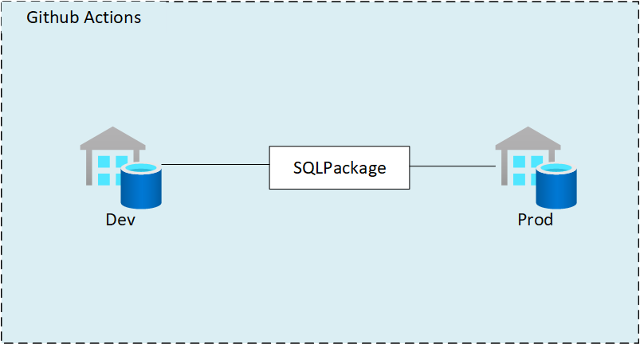

# Creating a CI/CD Process for Synapse SQL
*2021-10-04*

Synapse and Synapse Pipelines have a deep and thorough integration with git and github. Each change and modification is committed to git which allows for common git patterns such as [gitflow](https://www.atlassian.com/git/tutorials/comparing-workflows/gitflow-workflow).  Further, this git integration makes it relatively straight forward to implement a CI/CD process for promotion into production environments (more on that in future post).  But what happens when you want to include the Synapse SQL Pool database schema with that same CI/CD process?  Sadly, that isn't built into Synapse, and it's something you have to manage yourself. But fret not, there is a way to do this without manually updating the database schemas! 

In this post, we'll review how to migrate changes from one Synapse SQL Pool to another, and how to integrate that into a CI/CD pipeline in github using github actions. 

## Overview

In this post we will assume we have two Synapse instances.  One for dev, one for prod.  We need to sync production with development. 

We will use SQLPackage and DACPACs to manage the synchronization and promotion of development to production.  This promotion will be orchestrated with *Github Actions*, but you could use Azure DevOps as well following a similar process.  Maybe an additional post about that in the future!

## DACPAC

SQL has long had a mechanism for creating, managing, and updating schemas in a database.  This is a DAC, or [Data-Tier Application](https://docs.microsoft.com/en-us/sql/relational-databases/data-tier-applications/data-tier-applications?view=sql-server-ver15).   For our purposes, we really only need to understand that this is a method of encapsulating all database schema information, including tables, views, and instance objects, for a specific database.  This information is contained within a .dacpac file, which can then be *applied* to other databases to match that schema.  The .dacpac file can be created a number of ways, with a variety of tools.  For our purposes, we will be using the *SQLPackage* tool to both extract and apply a .dacpac. 

## SQL Package

[SQLPackage.exe](https://docs.microsoft.com/en-us/sql/tools/sqlpackage/sqlpackage?view=sql-server-ver15) is a command line utility that automates various tasks against a SQL Server (including Synapse SQL Pools).  This includes extracting schema information from a SQL database, and publishing a schema (DACPAC) against a database.  These are the two tasks we'll use in our CI/CD process. 

To start, let's test to make sure we can run these tasks manually, without an automated CI/CD process. 

### Manual SQLPackage Commands

It's important to understand how the CI/CD process will work.  To do this, we will go through how the SQLPackage.exe program works, which calls are made, and what its outputs are.

1. Before we begin, [download SQLPackage](https://docs.microsoft.com/en-us/sql/tools/sqlpackage/sqlpackage-download?view=sql-server-ver15).  
    >If you installed on windows, be sure to at `C:\Program Files\Microsoft SQL Server\150\DAC\bin` into your PATH environment variable, **or** make sure you cd into the directory after opening a command prompt. 
2. Open a command prompt, and go to the directory of where the SQL Package was installed or extracted.
3. Now, the first thing we do is extract a DACPAC from the source database server. In our manual process, we'll use a sql login as the authentication mechanism. 

    ```
    .\SQLPackage.exe /TargetFile:"C:\temp\sql_current_version.dacpac" /Action:Extract /SourceServerName:"[servername].sql.azuresynapse.net,1433" /SourceDatabaseName:"TestDedicatedPool" /SourceUser:adminuser /SourcePassword:"********"
    ```

    
4. After the DACPAC is generated, we can test applying it to another database. This time, we will use the [Publish](https://docs.microsoft.com/en-us/sql/tools/sqlpackage/sqlpackage-publish?view=sql-server-ver15) action.  Again, using the manual method, we'll authenticate using a SQL login.   In our testing, we have an empty SQL Pool.  The expectation is after we run the Publish action, the database will match the schema of the source database. 

    

    ```
     .\SqlPackage.exe /TargetFile:"C:\temp\sql_current_version.dacpac" /Action:Publish /TargetServerName:"[servername].sql.azuresynapse.net,1433" /TargetDatabaseName:"TestDedicatedPool" /TargetUser:adminuser /TargetPassword:"********"
    ```

    If everything worked, you should see an output similar to:
    

    Now let's check the database using SSMS. 
    

    Party time!!

    

## Automation

Now that we have the process of extracting and publishing a DACPAC using SQLPackage, we can move onto automating this into our CI/CD pipelines. 

For this post, we will use github actions, however it can easily be adapted to Azure DevOps Pipelines.  In fact, there is documentation on how to run [SQLPacakge on Microsoft's website](https://docs.microsoft.com/en-us/sql/tools/sqlpackage/sqlpackage-pipelines?view=sql-server-ver15#additional-sqlpackage-examples). 

> Note: the github action referenced says that only Publish is supported, and doesn't say Extract is supported.  But if you look at the code of the action, you can see that Extract will work fine. 

## Authentication

We have two options for authentication for the CI/CD pipelines.  
1. SQL authentication
2. Service principals. 

SQL authentication is relatively straight forward.  As with the manual steps we took previously, we use a SQL username and password for authentication.  This time however, we must specify this all in a connection string.  For example, the connection string would be something like: 
```
Server=tcp:[servername].sql.azuresynapse.net,1433;Initial Catalog=TestDedicatedPool;Persist Security Info=False;User ID=sqladminuser;Password={your_password};MultipleActiveResultSets=False;Encrypt=True;TrustServerCertificate=False;Connection Timeout=30;
```

For service principals, it's a bit more complex, but likely the better way to go for production CI/CD pipelines. 

### Service Principal Setup

We will create **one** service principal for our CI/CD sql schema updating pipeline.  This service principal will be granted the *db_owner* for the target.

1. Head over to the [Azure Portal](https://portal.azure.com)

2. Open *Azure Active Directory*

3. Click *App Registrations*

    

4. Click *New registration*
    
    

5. Enter in a name for the Service Principal.  After, click Register
    
    

    **Important**: Write down the Application (client) ID and the Tenant ID.  This is used later. 

6. Click Certificates & secrets, and then click *New client secret*. 

    

    **Important**: Write down the secret value.  This will be used later. 

7. Grant access to the resource groups or resources.  In this example, both Synapse SQL pools are in the same resource group, so we grant access at the resource group level. 

    a. Click Access Control, then Add. 
    

    b. Select the contributor role, and then search for the name of the Service Principal by **name**, then click *Save*.
    
    

8. [Grant access to the SQL Pool](https://docs.microsoft.com/en-us/azure/azure-sql/database/authentication-aad-service-principal) to the service principal.  Run `CREATE USER [AppName] FROM EXTERNAL PROVIDER; EXEC sp_addrolemember 'db_owner', [AppName]` on both the source and target databases.  AppName is the application / service principal name you created in step 5. 

    > **Important:** You must run this against the SQL Pool database, not the master. 

    > You can verify this worked by running the following command on the SQL Pool database: `SELECT name, type, type_desc, CAST(CAST(sid as varbinary(16)) as uniqueidentifier) as appId from sys.database_principals`

### Github Action

Now we will create the github action. This action will be responsible for 1) extracting the DACPAC from dev/test, and 2) publishing the dacpac to stage/prod/etc. 

> This post assumes that the synapse environment in dev is configured to use git and github.  If not, you can use any github repository to host the workflow.  However, it would be logical to host the workflow in the same repository as the Synapse configured git repository. 

#### Setup Authentication Secret

First thing we need to do is setup the Azure service principal's authentication secret in the repository.  This will be used to login to Azure and authenticate against the database(s). 
If you're using SQL authentication, you will create a secret with the password of the user. 

1. Click the Settings button for the repository, then click Secret.  Finally click *New repository secret*. 

    

2. Name it *AZURE_SQL_CREDENTIALS* and the value of:
    ```
    {"clientId": "<GUID>",
      "clientSecret": "<CLIENT_SECRET_VALUE>",
      "subscriptionId": "<GUID>",
      "tenantId": "<GUID>"}
    ```
    These values are from the application registration step.  

    

    > For more information on this, reference [this documentation](https://github.com/marketplace/actions/azure-login#configure-deployment-credentials)


#### Workflow

1. Create a new workflow
    

2. Copy in this source: <a href="workflow.yaml">SynapseSQLPromotion.yaml</a>

    

3. Make the necessary modifications to the workflow yaml, including all environment variables.  

3. Save

#### Testing Time

To test, click the Actions tab at the top, then the workflow you created.  Click *Run workflow*.


You should see the following if everything works!


## Summary

In this post we saw how we can keep two synapse SQL Pools in sync between environments.  We used the SQLPackage to generate DACPACs and apply the DACPAC to another SQL Pool.  We used service principals to authenticate github actions to automate these tasks. 