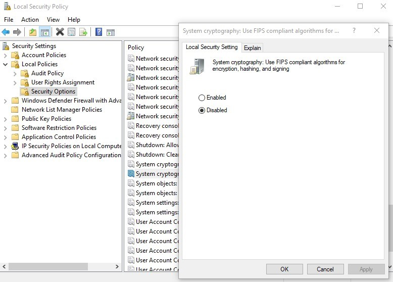

# Storage Exceptions with Purview SHIR
*2022-01-27*

## Introduction

Purview is Microsoft's new data governance and lineage tool.  Recently I had a customer who installed the Purview self-hosted integration runtime (SHIR) to retrieve metadata out of their on-premise SAP environment. 
At a high level, it looked like this: 

Very basic, and their first attempt at running a scan on an internal resource. 

After everything was set up in the Purview portal, a scan was initiated.   After a few seconds, it showed a failure in the portal and said *An error has occurred*, with no real details. 


## Troubleshooting the Purview SHIR
If an error occurs during a Purview scan using a self-hosted integration runtime, the console sometimes isn't very clear on why the error occurred.  The error typically just says the scan failed and an "error occurred".  

A more detailed way to see what the self-hosted integration runtime is doing is to look at the logs on the virtual machine itself.  
To do this, open the SHIR, and click on *diagnostics*.


Then click *View Logs*


## Diagnosis
Looking in the logs, we could see the following error and stack trace: 
```
System error while attempting to launch datascan process. ActivityId: cd86e853-2aca-47ea-90e3-1f27b5530aa6
Exception:'Type=Microsoft.WindowsAzure.Storage.StorageException,Message=Exception has been thrown by the target of an invocation.,Source=Microsoft.DataTransfer.Execution.DataScanExecutor,StackTrace=   at Microsoft.DataTransfer.Execution.DataScan.Retry.<DoAsync>d__1`1.MoveNext()
--- End of stack trace from previous location where exception was thrown ---
   at System.Runtime.ExceptionServices.ExceptionDispatchInfo.Throw()
   at System.Runtime.CompilerServices.TaskAwaiter.HandleNonSuccessAndDebuggerNotification(Task task)
   at Microsoft.DataTransfer.Execution.DataScan.DataScanExecutorHelper.<ReadScanConfigurationDataAsync>d__8.MoveNext()
--- End of stack trace from previous location where exception was thrown ---
   at System.Runtime.ExceptionServices.ExceptionDispatchInfo.Throw()
   at System.Runtime.CompilerServices.TaskAwaiter.HandleNonSuccessAndDebuggerNotification(Task task)
   at System.Runtime.CompilerServices.TaskAwaiter`1.GetResult()
   at Microsoft.DataTransfer.Execution.DataScan.DataScanExecutorHelper.<RetrieveScanConfigurationDataAsync>d__10.MoveNext()
--- End of stack trace from previous location where exception was thrown ---
   at System.Runtime.ExceptionServices.ExceptionDispatchInfo.Throw()
   at System.Runtime.CompilerServices.TaskAwaiter.HandleNonSuccessAndDebuggerNotification(Task task)
   at System.Runtime.CompilerServices.TaskAwaiter`1.GetResult()
   at Microsoft.DataTransfer.Execution.DataScan.DataScanExecutor.<ParseContextAndRunDataScan>d__20.MoveNext(),''Type=System.Reflection.TargetInvocationException,Message=Exception has been thrown by the target of an invocation.,Source=mscorlib,StackTrace=   at System.RuntimeMethodHandle.InvokeMethod(Object target, Object[] arguments, Signature sig, Boolean constructor)
   at System.Reflection.RuntimeConstructorInfo.Invoke(BindingFlags invokeAttr, Binder binder, Object[] parameters, CultureInfo culture)
   at System.Security.Cryptography.CryptoConfig.CreateFromName(String name, Object[] args)
   at System.Security.Cryptography.MD5.Create()
   at Microsoft.WindowsAzure.Storage.Core.Util.MD5Wrapper..ctor()
   at Microsoft.WindowsAzure.Storage.Core.Util.AsyncStreamCopier`1..ctor(Stream src, Stream dest, ExecutionState`1 state, IBufferManager bufferManager, Nullable`1 buffSize, Boolean calculateMd5, StreamDescriptor streamCopyState)
   at Microsoft.WindowsAzure.Storage.Core.Util.StreamExtensions.WriteToAsync[T](Stream stream, Stream toStream, IBufferManager bufferManager, Nullable`1 copyLength, Nullable`1 maxLength, Boolean calculateMd5, ExecutionState`1 executionState, StreamDescriptor streamCopyState, Action`1 completed)
   at Microsoft.WindowsAzure.Storage.Core.Executor.Executor.EndGetResponse[T](IAsyncResult getResponseResult),''Type=System.InvalidOperationException,Message=This implementation is not part of the Windows Platform FIPS validated cryptographic algorithms.,Source=mscorlib,StackTrace=   at System.Security.Cryptography.MD5CryptoServiceProvider..ctor(),'
Job ID: 279387a8-19d6-42e7-b804-a29f41bc3d19
Log ID: Error
```

Looking at the stack track, we could see that the Purview SHIR is using the *old* Azure Storage library, ```Microsoft.WindowsAzure.Storage```.   The more interesting of the stack trace is where is said: **This implementation is not part of the Windows Platform FIPS validated cryptographic algorithms**.  This leads me to think the old Azure Storage library is using some old cryptographic algorithm that on new Windows Server versions, have disabled by default.  

## Fix

The fix was relatively simple.  We just had to enable the non-FIPS validated cryptographic algorithms. 

1. Go to “Control Panel“.
2. Click “Administrative Tools“
3. Double click “Local Security Policy“
4. In “Local Security Settings“, expand “Local Policies“. Then click “Security Options“
5. Double click “System cryptography: Use FIPS compliant algorithms for encryption, hashing, and signing” 
6. Select “Disabled“
7. Click “OK“
8. Restart the server



The real fix should be that the Purview team use the latest and greatest Azure Storage libraries.  I would assume this will be updated at some point in the future!  
