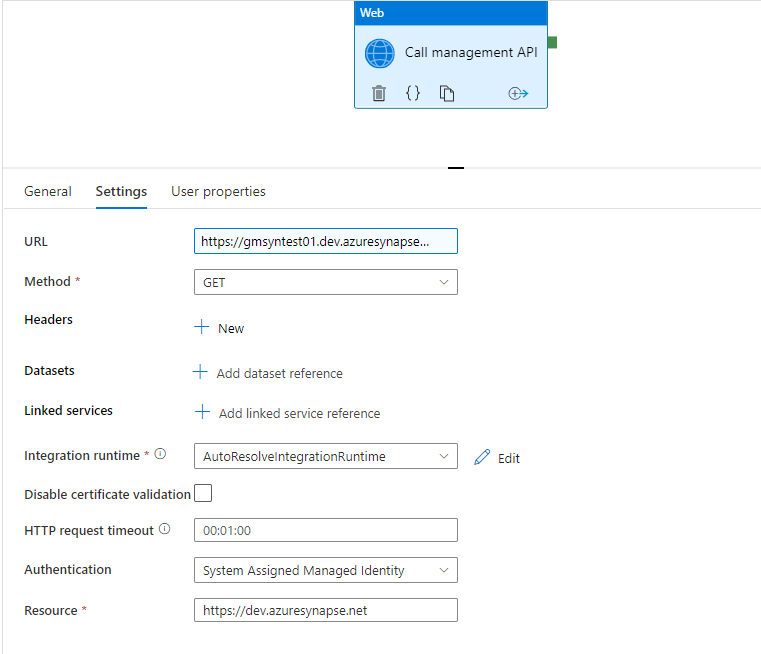

# Calling the Synapse API from a Synapse Pipeline
*2022-06-02*

There are situations when you want to either automate something from within Synapse using the API, or just find out metadata about your own pipeline run.  In these situations, calling the API from a Synapse pipeline itself is required.  

Thankfully, the Synapse API is extremely easy to use, and in this case, extremely easy to authenticate against.  

The Synapse workspace has a built in [managed system identity](https://docs.microsoft.com/en-us/azure/active-directory/managed-identities-azure-resources/overview) (MSI).  This is a special type of principal that lets the workspace authenticate as itself and access anything that the MSI has been granted access to.  In terms of Synapse, it already has access to itself, so it can easily call the the Synapse API and query information about its own workspace.

To call the Synapse API from a pipeline, we only need one activity, a web activity. 

The details of the settings required are as follows:

| Setting | Details |
|---------|---------|
| URL | This is the URL of the workspace API.  It is in the format `{workspacedevendpoint}/route?apiversion={version}`.  For example, if you wanted to get just the information about your workspace, the following url would be used: `https://workspacename.dev.azuresynapse.net/workspace?api-version=2020-12-01`. More information about the API can be found here [https://docs.microsoft.com/en-us/rest/api/synapse/](https://docs.microsoft.com/en-us/rest/api/synapse/).
| Method | GET / POST / DELETE, etc.  Depends on the API method you're calling. | 
| Authentication | Set to System Assigned Managed Identity |
| Resource | Must be `https://dev.azuresynapse.net`.

After you've set up the activity, go ahead and debug the pipeline.  The output of the activity should have json result of the API call.